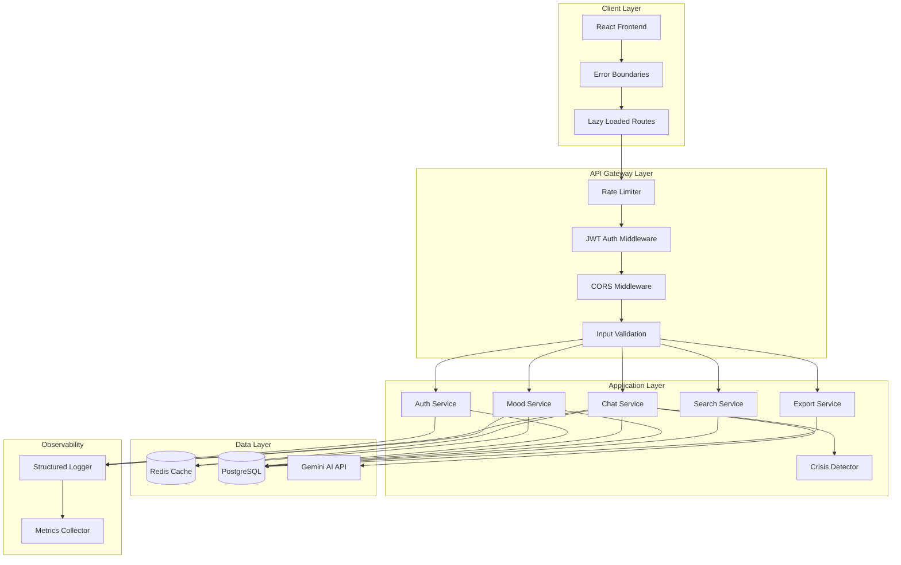
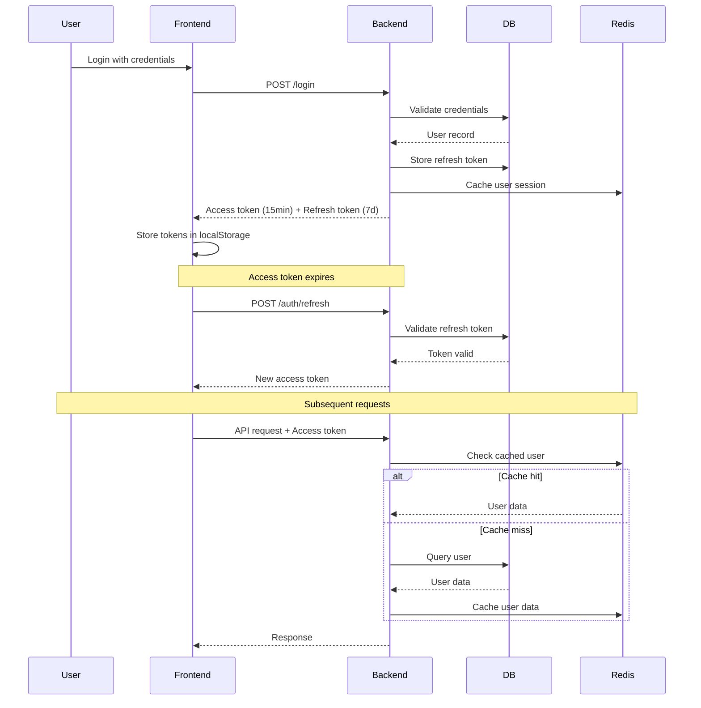
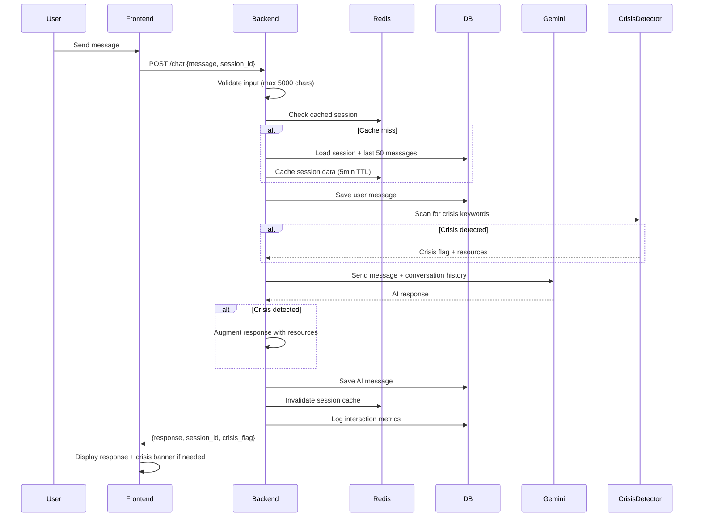

# Design Document: Mental Health Chatbot Enhancements

## Overview

This design document outlines the technical architecture for transforming the mental health chatbot from a prototype into a production-ready application. The enhancements focus on five key areas:

1. **Security**: JWT authentication with refresh tokens, rate limiting, CORS configuration, input validation
2. **Core Functionality**: Persistent storage, contextual AI conversations, session management, mood tracking, search, data export, crisis detection
3. **Performance**: Redis caching, database indexing, query optimization
4. **Frontend**: Error boundaries, code splitting, lazy loading
5. **Observability**: Comprehensive logging and monitoring

The system follows a client-server architecture with a React frontend communicating with a FastAPI backend that integrates with PostgreSQL for persistence, Redis for caching, and Google Gemini AI for conversational responses.

### Technology Stack

- **Frontend**: React 18, React Router, Vite
- **Backend**: FastAPI, Python 3.11+
- **Database**: PostgreSQL with SQLAlchemy ORM
- **Cache**: Redis
- **AI Service**: Google Gemini 2.5 Flash
- **Authentication**: JWT with refresh tokens
- **Rate Limiting**: SlowAPI
- **Testing**: Pytest (backend), Vitest (frontend)

## Architecture

### High-Level System Architecture




### Authentication Flow



### Chat Flow with Context



## Components and Interfaces

### Backend Components

#### 1. Authentication Service

**Responsibilities:**
- User registration and login
- JWT token generation and validation
- Refresh token management
- Password hashing and verification

**Key Functions:**
```python
def create_access_token(data: dict, expires_delta: timedelta = 15min) -> str
def create_refresh_token(user_id: int) -> str
def validate_refresh_token(token: str, db: Session) -> User
def revoke_refresh_token(token: str, db: Session) -> None
def hash_password(password: str) -> str
def verify_password(plain: str, hashed: str) -> bool
```

**API Endpoints:**
- `POST /signup` - Create new user account
- `POST /login` - Authenticate and receive tokens
- `POST /auth/refresh` - Exchange refresh token for new access token
- `POST /logout` - Revoke refresh token
- `PUT /profile` - Update user profile
- `DELETE /profile` - Delete user account

#### 2. Chat Service

**Responsibilities:**
- Manage chat sessions and messages
- Integrate with Gemini AI API
- Maintain conversation context
- Generate session titles
- Handle conversation summarization

**Key Functions:**
```python
def create_session(user_id: int, first_message: str) -> ChatSession
def get_session_history(session_id: int, limit: int = 50) -> List[ChatMessage]
def save_message(session_id: int, sender: str, text: str) -> ChatMessage
def generate_ai_response(message: str, history: List[ChatMessage]) -> str
def generate_session_title(first_message: str) -> str
def generate_summary(session_id: int) -> str
```

**API Endpoints:**
- `POST /chat` - Send message and receive AI response
- `GET /chat/sessions` - List user's chat sessions
- `GET /chat/sessions/{id}` - Get specific session with messages
- `PUT /chat/sessions/{id}` - Update session (title, tag)
- `DELETE /chat/sessions/{id}` - Delete session


#### 3. Mood Tracking Service

**Responsibilities:**
- Record mood entries
- Calculate mood analytics and trends
- Generate dashboard statistics

**Key Functions:**
```python
def create_mood_entry(user_id: int, mood_data: MoodRequest) -> MoodEntry
def get_mood_trend(user_id: int, days: int = 30) -> List[MoodEntry]
def calculate_mood_analytics(user_id: int, start_date: datetime, end_date: datetime) -> MoodAnalytics
def calculate_streak(user_id: int) -> int
```

**API Endpoints:**
- `POST /insights/mood` - Log mood entry
- `GET /insights/mood?days=30` - Get mood trend data
- `GET /insights/stats` - Get dashboard statistics
- `GET /insights/analytics?start=&end=` - Get mood analytics for date range

#### 4. Search Service

**Responsibilities:**
- Full-text search across chat messages
- Filter by session tags and date ranges
- Return relevant snippets with context

**Key Functions:**
```python
def search_messages(user_id: int, query: str, filters: SearchFilters) -> List[SearchResult]
def filter_by_tag(user_id: int, tag: str) -> List[ChatSession]
def filter_by_date_range(user_id: int, start: datetime, end: datetime) -> List[ChatSession]
```

**API Endpoints:**
- `GET /search?q=&tag=&start=&end=` - Search messages with filters

#### 5. Export Service

**Responsibilities:**
- Generate data exports in multiple formats
- Exclude sensitive system data
- Compress large exports

**Key Functions:**
```python
def export_as_json(user_id: int) -> dict
def export_as_csv(user_id: int) -> List[bytes]
def export_as_pdf(user_id: int) -> bytes
def create_export_archive(user_id: int, format: str) -> bytes
```

**API Endpoints:**
- `GET /export?format=json` - Export user data in specified format

#### 6. Crisis Detection Service

**Responsibilities:**
- Scan messages for crisis keywords
- Flag high-priority messages
- Provide emergency resource recommendations

**Key Functions:**
```python
def detect_crisis(message: str) -> CrisisDetection
def get_crisis_resources() -> List[EmergencyResource]
def log_crisis_event(user_id: int, message_id: int, keywords: List[str]) -> None
```

**Configuration:**
```python
CRISIS_KEYWORDS = [
    "suicide", "kill myself", "end my life", "self-harm", 
    "hurt myself", "want to die", "no reason to live"
]

EMERGENCY_RESOURCES = {
    "US": {
        "hotline": "988 Suicide & Crisis Lifeline",
        "number": "988",
        "text": "Text 'HELLO' to 741741"
    }
}
```

#### 7. Rate Limiting Service

**Responsibilities:**
- Track request counts per user
- Enforce rate limits
- Provide retry-after headers

**Configuration:**
```python
RATE_LIMITS = {
    "/chat": "10/minute, 100/hour",
    "/insights/mood": "20/minute",
    "/search": "30/minute",
    "/export": "5/hour"
}
```

#### 8. Caching Service

**Responsibilities:**
- Cache frequently accessed data
- Invalidate cache on updates
- Fallback to database on cache miss

**Caching Strategy:**
```python
CACHE_CONFIG = {
    "user_profile": {"ttl": 600},  # 10 minutes
    "chat_session": {"ttl": 300},  # 5 minutes
    "mood_analytics": {"ttl": 900},  # 15 minutes
    "session_list": {"ttl": 300}  # 5 minutes
}
```

### Frontend Components

#### 1. Error Boundary Component

**Purpose:** Catch React component errors and display fallback UI

```jsx
class ErrorBoundary extends React.Component {
  state = { hasError: false, error: null }
  
  static getDerivedStateFromError(error) {
    return { hasError: true, error }
  }
  
  componentDidCatch(error, errorInfo) {
    console.error('Error caught by boundary:', error, errorInfo)
    // Log to monitoring service
  }
  
  render() {
    if (this.state.hasError) {
      return <ErrorFallback error={this.state.error} />
    }
    return this.props.children
  }
}
```

#### 2. API Client with Retry Logic

**Purpose:** Handle API requests with automatic token refresh and retry

```javascript
class ApiClient {
  async request(endpoint, options) {
    try {
      const response = await fetch(endpoint, {
        ...options,
        headers: {
          'Authorization': `Bearer ${getAccessToken()}`,
          ...options.headers
        }
      })
      
      if (response.status === 401) {
        await this.refreshToken()
        return this.request(endpoint, options)
      }
      
      return response
    } catch (error) {
      if (this.shouldRetry(error)) {
        await this.exponentialBackoff()
        return this.request(endpoint, options)
      }
      throw error
    }
  }
  
  async refreshToken() {
    const refreshToken = getRefreshToken()
    const response = await fetch('/auth/refresh', {
      method: 'POST',
      body: JSON.stringify({ refresh_token: refreshToken })
    })
    const { access_token } = await response.json()
    setAccessToken(access_token)
  }
}
```

#### 3. Lazy Loaded Route Components

**Purpose:** Code splitting for faster initial load

```javascript
const Dashboard = lazy(() => import('./pages/Dashboard'))
const Chatbot = lazy(() => import('./components/Chatbot'))
const Insights = lazy(() => import('./pages/Insights'))
const History = lazy(() => import('./pages/History'))

function App() {
  return (
    <Suspense fallback={<LoadingSpinner />}>
      <Routes>
        <Route path="/dashboard" element={<Dashboard />} />
        <Route path="/chat" element={<Chatbot />} />
        <Route path="/insights" element={<Insights />} />
        <Route path="/history" element={<History />} />
      </Routes>
    </Suspense>
  )
}
```


## Data Models

### Database Schema

#### Users Table
```sql
CREATE TABLE users (
    id SERIAL PRIMARY KEY,
    email VARCHAR(255) UNIQUE NOT NULL,
    name VARCHAR(255),
    username VARCHAR(255) UNIQUE,
    password VARCHAR(255),
    google_id VARCHAR(255),
    picture VARCHAR(500),
    created_at TIMESTAMP DEFAULT CURRENT_TIMESTAMP,
    INDEX idx_users_email (email),
    INDEX idx_users_username (username)
);
```

#### Chat Sessions Table
```sql
CREATE TABLE chat_sessions (
    id SERIAL PRIMARY KEY,
    user_id INTEGER NOT NULL REFERENCES users(id) ON DELETE CASCADE,
    title VARCHAR(100) NOT NULL DEFAULT 'New Conversation',
    tag VARCHAR(50) DEFAULT 'General',
    summary TEXT,
    created_at TIMESTAMP DEFAULT CURRENT_TIMESTAMP,
    updated_at TIMESTAMP DEFAULT CURRENT_TIMESTAMP,
    INDEX idx_sessions_user_id (user_id),
    INDEX idx_sessions_tag (tag),
    INDEX idx_sessions_updated_at (updated_at)
);
```

#### Chat Messages Table
```sql
CREATE TABLE chat_messages (
    id SERIAL PRIMARY KEY,
    session_id INTEGER NOT NULL REFERENCES chat_sessions(id) ON DELETE CASCADE,
    sender VARCHAR(10) NOT NULL CHECK (sender IN ('user', 'ai')),
    text TEXT NOT NULL,
    created_at TIMESTAMP DEFAULT CURRENT_TIMESTAMP,
    INDEX idx_messages_session_created (session_id, created_at),
    FULLTEXT INDEX idx_messages_text (text)
);
```

#### Mood Entries Table
```sql
CREATE TABLE mood_entries (
    id SERIAL PRIMARY KEY,
    user_id INTEGER NOT NULL REFERENCES users(id) ON DELETE CASCADE,
    mood_score FLOAT NOT NULL CHECK (mood_score >= 1 AND mood_score <= 10),
    energy_level FLOAT NOT NULL CHECK (energy_level >= 1 AND energy_level <= 10),
    stress_level FLOAT NOT NULL CHECK (stress_level >= 1 AND stress_level <= 10),
    date TIMESTAMP DEFAULT CURRENT_TIMESTAMP,
    INDEX idx_mood_user_date (user_id, date)
);
```

#### Refresh Tokens Table (New)
```sql
CREATE TABLE refresh_tokens (
    id SERIAL PRIMARY KEY,
    user_id INTEGER NOT NULL REFERENCES users(id) ON DELETE CASCADE,
    token VARCHAR(500) UNIQUE NOT NULL,
    expires_at TIMESTAMP NOT NULL,
    created_at TIMESTAMP DEFAULT CURRENT_TIMESTAMP,
    revoked BOOLEAN DEFAULT FALSE,
    INDEX idx_refresh_token (token),
    INDEX idx_refresh_user_id (user_id)
);
```

#### Crisis Events Table (New)
```sql
CREATE TABLE crisis_events (
    id SERIAL PRIMARY KEY,
    user_id INTEGER NOT NULL REFERENCES users(id) ON DELETE CASCADE,
    message_id INTEGER REFERENCES chat_messages(id) ON DELETE SET NULL,
    keywords TEXT[],
    created_at TIMESTAMP DEFAULT CURRENT_TIMESTAMP,
    INDEX idx_crisis_user_id (user_id),
    INDEX idx_crisis_created_at (created_at)
);
```

#### Notifications Table (New)
```sql
CREATE TABLE notifications (
    id SERIAL PRIMARY KEY,
    user_id INTEGER NOT NULL REFERENCES users(id) ON DELETE CASCADE,
    type VARCHAR(50) NOT NULL,
    message TEXT NOT NULL,
    read BOOLEAN DEFAULT FALSE,
    created_at TIMESTAMP DEFAULT CURRENT_TIMESTAMP,
    INDEX idx_notifications_user_read (user_id, read),
    INDEX idx_notifications_created_at (created_at)
);
```


### SQLAlchemy Models

#### RefreshToken Model (New)
```python
class RefreshToken(Base):
    __tablename__ = "refresh_tokens"
    
    id = Column(Integer, primary_key=True, index=True)
    user_id = Column(Integer, ForeignKey("users.id"))
    token = Column(String, unique=True, nullable=False, index=True)
    expires_at = Column(DateTime, nullable=False)
    created_at = Column(DateTime, default=datetime.utcnow)
    revoked = Column(Boolean, default=False)
    
    user = relationship("User", back_populates="refresh_tokens")
```

#### CrisisEvent Model (New)
```python
class CrisisEvent(Base):
    __tablename__ = "crisis_events"
    
    id = Column(Integer, primary_key=True, index=True)
    user_id = Column(Integer, ForeignKey("users.id"))
    message_id = Column(Integer, ForeignKey("chat_messages.id"), nullable=True)
    keywords = Column(ARRAY(String))
    created_at = Column(DateTime, default=datetime.utcnow, index=True)
    
    user = relationship("User", back_populates="crisis_events")
    message = relationship("ChatMessage")
```

#### Notification Model (New)
```python
class Notification(Base):
    __tablename__ = "notifications"
    
    id = Column(Integer, primary_key=True, index=True)
    user_id = Column(Integer, ForeignKey("users.id"))
    type = Column(String, nullable=False)
    message = Column(Text, nullable=False)
    read = Column(Boolean, default=False)
    created_at = Column(DateTime, default=datetime.utcnow, index=True)
    
    user = relationship("User", back_populates="notifications")
```

#### Updated User Model
```python
class User(Base):
    __tablename__ = "users"
    
    # ... existing fields ...
    
    sessions = relationship("ChatSession", back_populates="user", cascade="all, delete-orphan")
    moods = relationship("MoodEntry", back_populates="user", cascade="all, delete-orphan")
    refresh_tokens = relationship("RefreshToken", back_populates="user", cascade="all, delete-orphan")
    crisis_events = relationship("CrisisEvent", back_populates="user", cascade="all, delete-orphan")
    notifications = relationship("Notification", back_populates="user", cascade="all, delete-orphan")
```

#### Updated ChatSession Model
```python
class ChatSession(Base):
    __tablename__ = "chat_sessions"
    
    id = Column(Integer, primary_key=True, index=True)
    user_id = Column(Integer, ForeignKey("users.id"), index=True)
    title = Column(String, nullable=False, default="New Conversation")
    tag = Column(String, nullable=True, default="General", index=True)
    summary = Column(Text, nullable=True)  # New field
    created_at = Column(DateTime, default=datetime.utcnow)
    updated_at = Column(DateTime, default=datetime.utcnow, onupdate=datetime.utcnow, index=True)
    
    user = relationship("User", back_populates="sessions")
    messages = relationship("ChatMessage", back_populates="session", cascade="all, delete-orphan")
```

### Pydantic Request/Response Models

```python
# Authentication
class TokenResponse(BaseModel):
    access_token: str
    refresh_token: str
    token_type: str = "bearer"

class RefreshRequest(BaseModel):
    refresh_token: str

# Chat
class ChatRequest(BaseModel):
    message: str = Field(..., min_length=1, max_length=5000)
    session_id: Optional[int] = None

class ChatResponse(BaseModel):
    response: str
    session_id: int
    crisis_detected: bool = False
    emergency_resources: Optional[List[EmergencyResource]] = None

# Mood
class MoodRequest(BaseModel):
    mood_score: float = Field(..., ge=1, le=10)
    energy_level: float = Field(..., ge=1, le=10)
    stress_level: float = Field(..., ge=1, le=10)

class MoodAnalytics(BaseModel):
    avg_mood: float
    avg_energy: float
    avg_stress: float
    min_mood: float
    max_mood: float
    trend: str  # "improving", "declining", "stable"

# Search
class SearchFilters(BaseModel):
    query: Optional[str] = None
    tag: Optional[str] = None
    start_date: Optional[datetime] = None
    end_date: Optional[datetime] = None

class SearchResult(BaseModel):
    session_id: int
    session_title: str
    message_snippet: str
    created_at: datetime
```


### Redis Cache Keys and Structure

```python
# Cache key patterns
CACHE_KEYS = {
    "user_profile": "user:{user_id}:profile",
    "session_list": "user:{user_id}:sessions",
    "session_data": "session:{session_id}:data",
    "session_messages": "session:{session_id}:messages",
    "mood_analytics": "user:{user_id}:mood:analytics:{days}",
    "rate_limit": "ratelimit:{user_id}:{endpoint}"
}

# Cache data structures
# User profile (Hash)
{
    "id": "123",
    "email": "user@example.com",
    "name": "John Doe",
    "username": "johndoe"
}

# Session list (List of JSON strings)
[
    '{"id": 1, "title": "Anxiety discussion", "tag": "Anxiety", "updated_at": "2024-01-15T10:30:00"}',
    '{"id": 2, "title": "Sleep issues", "tag": "Sleep", "updated_at": "2024-01-14T15:20:00"}'
]

# Session messages (List of JSON strings, limited to last 50)
[
    '{"id": 1, "sender": "user", "text": "I feel anxious", "created_at": "2024-01-15T10:00:00"}',
    '{"id": 2, "sender": "ai", "text": "I understand...", "created_at": "2024-01-15T10:00:05"}'
]
```

### API Endpoint Specifications

#### Authentication Endpoints

**POST /signup**
```
Request:
{
    "email": "user@example.com",
    "password": "SecurePass123!",
    "name": "John Doe",
    "username": "johndoe"
}

Response: 201 Created
{
    "msg": "Signup successful",
    "user": {
        "name": "John Doe",
        "username": "johndoe",
        "email": "user@example.com",
        "created_at": "2024-01-15T10:00:00"
    },
    "access_token": "eyJ...",
    "refresh_token": "eyJ...",
    "token_type": "bearer"
}

Errors:
- 400: Email already registered
- 400: Username already taken
- 422: Invalid email format or password too weak
```

**POST /login**
```
Request:
{
    "email": "user@example.com",
    "password": "SecurePass123!"
}

Response: 200 OK
{
    "access_token": "eyJ...",
    "refresh_token": "eyJ...",
    "token_type": "bearer",
    "user": {
        "name": "John Doe",
        "username": "johndoe",
        "email": "user@example.com"
    }
}

Errors:
- 401: Invalid credentials
```

**POST /auth/refresh**
```
Request:
{
    "refresh_token": "eyJ..."
}

Response: 200 OK
{
    "access_token": "eyJ...",
    "token_type": "bearer"
}

Errors:
- 401: Invalid or expired refresh token
- 401: Refresh token revoked
```

**POST /logout**
```
Headers:
Authorization: Bearer <access_token>

Request:
{
    "refresh_token": "eyJ..."
}

Response: 200 OK
{
    "msg": "Logged out successfully"
}
```

#### Chat Endpoints

**POST /chat**
```
Headers:
Authorization: Bearer <access_token>

Request:
{
    "message": "I've been feeling anxious lately",
    "session_id": 123  // Optional, creates new session if omitted
}

Response: 200 OK
{
    "response": "I hear you. Anxiety can be really challenging...",
    "session_id": 123,
    "crisis_detected": false
}

Rate Limits: 10/minute, 100/hour

Errors:
- 401: Unauthorized
- 422: Message too long (>5000 chars) or empty
- 429: Rate limit exceeded
- 503: AI service quota exceeded
```

**GET /history**
```
Headers:
Authorization: Bearer <access_token>

Response: 200 OK
[
    {
        "id": 123,
        "title": "Anxiety discussion",
        "tag": "Anxiety",
        "created_at": "2024-01-15T10:00:00",
        "updated_at": "2024-01-15T11:30:00",
        "message_count": 24,
        "preview": "I've been feeling anxious lately..."
    }
]
```

**GET /history/{session_id}**
```
Headers:
Authorization: Bearer <access_token>

Response: 200 OK
[
    {
        "id": 1,
        "sender": "user",
        "text": "I've been feeling anxious lately",
        "created_at": "2024-01-15T10:00:00"
    },
    {
        "id": 2,
        "sender": "ai",
        "text": "I hear you. Anxiety can be challenging...",
        "created_at": "2024-01-15T10:00:05"
    }
]

Errors:
- 404: Session not found or doesn't belong to user
```

**PUT /history/{session_id}**
```
Headers:
Authorization: Bearer <access_token>

Request:
{
    "title": "Updated title",
    "tag": "Anxiety"  // Optional
}

Response: 200 OK
{
    "id": 123,
    "title": "Updated title",
    "tag": "Anxiety",
    "updated_at": "2024-01-15T12:00:00"
}

Errors:
- 404: Session not found
- 422: Title too long (>100 chars)
- 422: Invalid tag value
```


**DELETE /history/{session_id}**
```
Headers:
Authorization: Bearer <access_token>

Response: 200 OK
{
    "message": "Session deleted successfully"
}

Errors:
- 404: Session not found
```

#### Mood Tracking Endpoints

**POST /insights/mood**
```
Headers:
Authorization: Bearer <access_token>

Request:
{
    "mood_score": 7.5,
    "energy_level": 6.0,
    "stress_level": 4.5
}

Response: 201 Created
{
    "id": 456,
    "mood_score": 7.5,
    "energy_level": 6.0,
    "stress_level": 4.5,
    "date": "2024-01-15T10:00:00"
}

Rate Limit: 20/minute

Errors:
- 422: Values out of range (must be 1-10)
```

**GET /insights/mood?days=30**
```
Headers:
Authorization: Bearer <access_token>

Query Parameters:
- days: Number of days to retrieve (default: 7, max: 365)

Response: 200 OK
[
    {
        "id": 456,
        "mood_score": 7.5,
        "energy_level": 6.0,
        "stress_level": 4.5,
        "date": "2024-01-15T10:00:00"
    }
]
```

**GET /insights/analytics?start=2024-01-01&end=2024-01-31**
```
Headers:
Authorization: Bearer <access_token>

Query Parameters:
- start: Start date (ISO format, optional)
- end: End date (ISO format, optional)

Response: 200 OK
{
    "avg_mood": 7.2,
    "avg_energy": 6.5,
    "avg_stress": 5.1,
    "min_mood": 4.0,
    "max_mood": 9.5,
    "trend": "improving",
    "weekly_averages": [
        {"week": "2024-W01", "avg_mood": 6.8, "avg_energy": 6.2, "avg_stress": 5.5},
        {"week": "2024-W02", "avg_mood": 7.6, "avg_energy": 6.8, "avg_stress": 4.7}
    ]
}
```

**GET /insights/stats**
```
Headers:
Authorization: Bearer <access_token>

Response: 200 OK
{
    "total_sessions": 45,
    "mood_score_percent": 72.0,
    "journals": 45,
    "day_streak": 7
}
```

#### Search Endpoint

**GET /search?q=anxiety&tag=Anxiety&start=2024-01-01&end=2024-01-31**
```
Headers:
Authorization: Bearer <access_token>

Query Parameters:
- q: Search query (optional)
- tag: Filter by session tag (optional)
- start: Start date (ISO format, optional)
- end: End date (ISO format, optional)

Response: 200 OK
[
    {
        "session_id": 123,
        "session_title": "Anxiety discussion",
        "message_snippet": "...feeling anxious lately and I don't know...",
        "created_at": "2024-01-15T10:00:00",
        "tag": "Anxiety"
    }
]

Rate Limit: 30/minute
```

#### Export Endpoint

**GET /export?format=json**
```
Headers:
Authorization: Bearer <access_token>

Query Parameters:
- format: Export format (json, csv, pdf)

Response: 200 OK
Content-Type: application/json (or application/zip for large exports)

{
    "export_timestamp": "2024-01-15T12:00:00",
    "user": {
        "email": "user@example.com",
        "name": "John Doe",
        "username": "johndoe"
    },
    "sessions": [...],
    "moods": [...]
}

Rate Limit: 5/hour

Errors:
- 422: Invalid format
- 202: Export processing (for large datasets)
```

#### Notification Endpoints

**GET /notifications**
```
Headers:
Authorization: Bearer <access_token>

Response: 200 OK
[
    {
        "id": 789,
        "type": "mood_reminder",
        "message": "Time for your daily mood check-in!",
        "read": false,
        "created_at": "2024-01-15T09:00:00"
    }
]
```

**PUT /notifications/{id}/read**
```
Headers:
Authorization: Bearer <access_token>

Response: 200 OK
{
    "id": 789,
    "read": true
}
```


## Security Implementation

### JWT Token Strategy

**Access Token:**
- Expiry: 15 minutes
- Payload: `{"email": "user@example.com", "exp": 1234567890}`
- Algorithm: HS256
- Storage: Frontend localStorage (with XSS protection considerations)

**Refresh Token:**
- Expiry: 7 days
- Stored in database with user association
- One-time use (rotated on each refresh)
- Revoked on logout
- Hashed before storage

**Token Refresh Flow:**
1. Frontend detects 401 error on API request
2. Automatically calls `/auth/refresh` with refresh token
3. Backend validates refresh token against database
4. Issues new access token
5. Retries original request with new token
6. If refresh fails, redirects to login

### Input Validation

**Message Validation:**
```python
class ChatRequest(BaseModel):
    message: str = Field(
        ..., 
        min_length=1, 
        max_length=5000,
        description="User message text"
    )
    session_id: Optional[int] = Field(None, ge=1)
    
    @validator('message')
    def validate_message(cls, v):
        if not v or v.isspace():
            raise ValueError('Message cannot be empty or whitespace only')
        return v.strip()
```

**Email Validation:**
```python
EMAIL_REGEX = r'^[a-zA-Z0-9._%+-]+@[a-zA-Z0-9.-]+\.[a-zA-Z]{2,}$'

class UserCreate(BaseModel):
    email: EmailStr  # Pydantic built-in email validation
    password: str = Field(..., min_length=8, max_length=100)
    name: str = Field(..., min_length=1, max_length=255)
    username: str = Field(..., min_length=3, max_length=50, regex=r'^[a-zA-Z0-9_-]+$')
```

**SQL Injection Prevention:**
- All database queries use SQLAlchemy ORM with parameterized queries
- No raw SQL string concatenation
- Input sanitization through Pydantic models

### CORS Configuration

```python
# backend/main.py
CORS_ORIGINS = os.getenv("CORS_ORIGINS", "").split(",")

if not CORS_ORIGINS or CORS_ORIGINS == [""]:
    raise ValueError("CORS_ORIGINS environment variable must be set")

app.add_middleware(
    CORSMiddleware,
    allow_origins=CORS_ORIGINS,
    allow_credentials=True,
    allow_methods=["GET", "POST", "PUT", "DELETE"],
    allow_headers=["Authorization", "Content-Type"],
    expose_headers=["Cross-Origin-Opener-Policy"],
    max_age=3600
)
```

**Environment Configuration:**
```bash
# .env
CORS_ORIGINS=http://localhost:5173,https://app.example.com
```

### Security Headers

```python
from fastapi.middleware.trustedhost import TrustedHostMiddleware
from starlette.middleware.base import BaseHTTPMiddleware

class SecurityHeadersMiddleware(BaseHTTPMiddleware):
    async def dispatch(self, request, call_next):
        response = await call_next(request)
        response.headers["X-Content-Type-Options"] = "nosniff"
        response.headers["X-Frame-Options"] = "DENY"
        response.headers["X-XSS-Protection"] = "1; mode=block"
        response.headers["Content-Security-Policy"] = (
            "default-src 'self'; "
            "script-src 'self' 'unsafe-inline' 'unsafe-eval'; "
            "style-src 'self' 'unsafe-inline'; "
            "img-src 'self' data: https:; "
            "font-src 'self' data:; "
            "connect-src 'self' https://generativelanguage.googleapis.com"
        )
        
        if os.getenv("ENVIRONMENT") == "production":
            response.headers["Strict-Transport-Security"] = (
                "max-age=31536000; includeSubDomains"
            )
        
        return response

app.add_middleware(SecurityHeadersMiddleware)
```

### Rate Limiting Implementation

```python
from slowapi import Limiter, _rate_limit_exceeded_handler
from slowapi.util import get_remote_address
from slowapi.errors import RateLimitExceeded

# Custom key function to use user ID from JWT
def get_user_id_from_token(request: Request) -> str:
    auth_header = request.headers.get("Authorization", "")
    if auth_header.startswith("Bearer "):
        token = auth_header.split(" ")[1]
        try:
            payload = decode_token(token)
            return payload.get("email", get_remote_address(request))
        except:
            pass
    return get_remote_address(request)

limiter = Limiter(key_func=get_user_id_from_token)
app.state.limiter = limiter
app.add_exception_handler(RateLimitExceeded, _rate_limit_exceeded_handler)

# Apply to endpoints
@router.post("/chat")
@limiter.limit("10/minute")
@limiter.limit("100/hour")
async def chat(request: Request, ...):
    ...
```

### Password Security

```python
from passlib.context import CryptContext

pwd_context = CryptContext(
    schemes=["bcrypt"],
    deprecated="auto",
    bcrypt__rounds=12  # Cost factor
)

def hash_password(password: str) -> str:
    return pwd_context.hash(password)

def verify_password(plain: str, hashed: str) -> bool:
    return pwd_context.verify(plain, hashed)
```

**Password Requirements:**
- Minimum 8 characters
- At least one uppercase letter
- At least one lowercase letter
- At least one digit
- At least one special character


## Caching Strategy

### Redis Configuration

```python
import redis
from redis.exceptions import RedisError

redis_client = redis.Redis(
    host=os.getenv("REDIS_HOST", "localhost"),
    port=int(os.getenv("REDIS_PORT", 6379)),
    db=0,
    decode_responses=True,
    socket_connect_timeout=5,
    socket_timeout=5,
    retry_on_timeout=True
)

def get_redis_client():
    try:
        redis_client.ping()
        return redis_client
    except RedisError:
        return None  # Fallback to database
```

### Cache Patterns

**1. Cache-Aside Pattern (Lazy Loading)**
```python
async def get_user_sessions(user_id: int, db: Session):
    cache_key = f"user:{user_id}:sessions"
    redis = get_redis_client()
    
    # Try cache first
    if redis:
        cached = redis.get(cache_key)
        if cached:
            return json.loads(cached)
    
    # Cache miss - query database
    sessions = db.query(ChatSession).filter(
        ChatSession.user_id == user_id
    ).order_by(ChatSession.updated_at.desc()).all()
    
    # Store in cache
    if redis:
        redis.setex(
            cache_key,
            300,  # 5 minutes TTL
            json.dumps([s.to_dict() for s in sessions])
        )
    
    return sessions
```

**2. Write-Through Pattern (Invalidation on Update)**
```python
async def add_message(session_id: int, message: ChatMessage, db: Session):
    # Save to database
    db.add(message)
    db.commit()
    
    # Invalidate related caches
    redis = get_redis_client()
    if redis:
        redis.delete(f"session:{session_id}:messages")
        redis.delete(f"user:{message.session.user_id}:sessions")
```

**3. Time-Based Expiration for Analytics**
```python
async def get_mood_analytics(user_id: int, days: int, db: Session):
    cache_key = f"user:{user_id}:mood:analytics:{days}"
    redis = get_redis_client()
    
    if redis:
        cached = redis.get(cache_key)
        if cached:
            return json.loads(cached)
    
    # Calculate analytics
    analytics = calculate_mood_analytics(user_id, days, db)
    
    # Cache for 15 minutes
    if redis:
        redis.setex(cache_key, 900, json.dumps(analytics))
    
    return analytics
```

### Cache Invalidation Rules

| Event | Invalidate |
|-------|-----------|
| New message added | `session:{id}:messages`, `user:{id}:sessions` |
| Session updated | `session:{id}:data`, `user:{id}:sessions` |
| Session deleted | `session:{id}:*`, `user:{id}:sessions` |
| Mood entry added | `user:{id}:mood:analytics:*` |
| User profile updated | `user:{id}:profile` |

## Performance Optimization

### Database Indexing Strategy

**Existing Indexes:**
- `users.email` (unique, for login queries)
- `users.username` (unique, for profile lookups)
- `chat_sessions.user_id` (for session retrieval)
- `chat_messages.session_id` (for message retrieval)
- `mood_entries.user_id` (for mood queries)

**New Composite Indexes:**
```sql
-- For message ordering within sessions
CREATE INDEX idx_messages_session_created 
ON chat_messages(session_id, created_at);

-- For mood analytics queries
CREATE INDEX idx_mood_user_date 
ON mood_entries(user_id, date);

-- For session filtering and sorting
CREATE INDEX idx_sessions_user_updated 
ON chat_sessions(user_id, updated_at DESC);

-- For tag-based filtering
CREATE INDEX idx_sessions_tag 
ON chat_sessions(tag);

-- For full-text search on messages
CREATE INDEX idx_messages_text_fulltext 
ON chat_messages USING GIN(to_tsvector('english', text));
```

### Query Optimization

**1. Pagination for Large Result Sets**
```python
@router.get("/history")
def get_sessions(
    page: int = 1,
    page_size: int = 20,
    db: Session = Depends(get_db),
    current_user: User = Depends(get_current_user)
):
    offset = (page - 1) * page_size
    sessions = db.query(ChatSession).filter(
        ChatSession.user_id == current_user.id
    ).order_by(
        ChatSession.updated_at.desc()
    ).limit(page_size).offset(offset).all()
    
    return sessions
```

**2. Select Specific Columns**
```python
# Instead of SELECT *
sessions = db.query(
    ChatSession.id,
    ChatSession.title,
    ChatSession.tag,
    ChatSession.updated_at
).filter(ChatSession.user_id == user_id).all()
```

**3. Eager Loading for Relationships**
```python
from sqlalchemy.orm import joinedload

# Avoid N+1 queries
sessions = db.query(ChatSession).options(
    joinedload(ChatSession.messages)
).filter(ChatSession.user_id == user_id).all()
```

**4. Limit Conversation History**
```python
# Only load last 50 messages for AI context
messages = db.query(ChatMessage).filter(
    ChatMessage.session_id == session_id
).order_by(
    ChatMessage.created_at.desc()
).limit(50).all()

messages.reverse()  # Oldest first for AI
```

### Frontend Performance

**1. Code Splitting Configuration**
```javascript
// vite.config.js
export default {
  build: {
    rollupOptions: {
      output: {
        manualChunks: {
          'vendor': ['react', 'react-dom', 'react-router-dom'],
          'charts': ['recharts'],
          'ui': ['@headlessui/react', '@heroicons/react']
        }
      }
    }
  }
}
```

**2. Route-Based Lazy Loading**
```javascript
import { lazy, Suspense } from 'react'

const Dashboard = lazy(() => import('./pages/Dashboard'))
const Chatbot = lazy(() => import('./components/Chatbot'))
const Insights = lazy(() => import('./pages/Insights'))

function App() {
  return (
    <Suspense fallback={<LoadingSpinner />}>
      <Routes>
        <Route path="/dashboard" element={<Dashboard />} />
        <Route path="/chat" element={<Chatbot />} />
        <Route path="/insights" element={<Insights />} />
      </Routes>
    </Suspense>
  )
}
```

**3. Preloading Critical Routes**
```javascript
// Preload after initial render
useEffect(() => {
  const preloadRoutes = async () => {
    await import('./pages/Dashboard')
    await import('./components/Chatbot')
  }
  
  // Preload after 2 seconds
  setTimeout(preloadRoutes, 2000)
}, [])
```


## Correctness Properties

*A property is a characteristic or behavior that should hold true across all valid executions of a system—essentially, a formal statement about what the system should do. Properties serve as the bridge between human-readable specifications and machine-verifiable correctness guarantees.*

### Property Reflection

After analyzing all acceptance criteria, I identified the following redundancies and consolidations:

**Redundancies Eliminated:**
- Requirements 1.3 and 1.5 are specific cases of 1.1 (invalid tokens) - consolidated into Property 1
- Requirement 7.3 duplicates 5.4 (tag filtering) - removed duplicate
- Requirements 3.2 and 3.3 (user/AI message storage) can be combined into a single property about message persistence
- Requirements 12.2, 12.4, and 12.6 (caching with TTL) follow the same pattern - combined into one property about cache population
- Requirements 16.1, 16.2, 16.3, and 16.6 (logging various events) follow the same pattern - combined into comprehensive logging property

**Properties Combined:**
- Authentication validation (1.1, 1.3, 1.5) → Single property about rejecting invalid tokens
- Message persistence (3.2, 3.3) → Single property about storing messages with correct metadata
- Cache TTL behavior (12.2, 12.4, 12.6) → Single property about cache population with TTL
- Logging behavior (16.1, 16.2, 16.3, 16.6) → Single property about structured logging

### Property 1: Authentication Token Validation

*For any* request to protected endpoints with an invalid, expired, or malformed JWT token, the system should return a 401 Unauthorized error without processing the request.

**Validates: Requirements 1.1, 1.3, 1.5**

### Property 2: Authenticated Request Processing

*For any* request to protected endpoints with a valid JWT token, the system should extract the correct user identity and process the request successfully.

**Validates: Requirements 1.2, 1.4**

### Property 3: Per-User Rate Limiting

*For any* user making requests to rate-limited endpoints, the system should track request counts independently per user (not per IP address) and enforce limits based on JWT token identity.

**Validates: Requirements 2.3, 2.6**

### Property 4: Rate Limit Response Headers

*For any* request that exceeds rate limits, the system should return a 429 status code with a Retry-After header indicating when the user can retry.

**Validates: Requirements 2.4**

### Property 5: Session Creation on First Message

*For any* user sending a message without specifying a session ID, the system should create a new chat session record in the database with a generated title.

**Validates: Requirements 3.1, 18.1**

### Property 6: Message Persistence with Linkage

*For any* message (user or AI) sent in a chat session, the system should store the message in the database with correct session linkage, sender identification, and timestamp.

**Validates: Requirements 3.2, 3.3**

### Property 7: Message Retrieval Ordering

*For any* chat session, when retrieving messages, the system should return all messages ordered chronologically by creation timestamp (oldest first).

**Validates: Requirements 3.4**

### Property 8: Conversation History Retrieval

*For any* existing chat session, when a user sends a new message, the system should retrieve all previous messages from that session to provide context.

**Validates: Requirements 4.1**

### Property 9: AI Context Formatting

*For any* conversation history sent to the AI service, the system should format messages according to the API requirements with correct role assignment (user/model) and message structure.

**Validates: Requirements 4.2, 4.3**

### Property 10: Default Session Tag Assignment

*For any* newly created chat session, the system should assign a default tag of "General" if no tag is specified.

**Validates: Requirements 5.1**

### Property 11: Session Tag Validation

*For any* attempt to set or update a session tag, the system should validate that the tag is one of the allowed categories and reject invalid tags.

**Validates: Requirements 5.2**

### Property 12: Tag-Based Session Filtering

*For any* user requesting sessions filtered by a specific tag, the system should return only sessions that have that exact tag value.

**Validates: Requirements 5.4, 7.3**

### Property 13: Session Tag Update Persistence

*For any* session tag update, the system should persist the new tag value and allow subsequent retrieval of the updated tag.

**Validates: Requirements 5.6**

### Property 14: Session Tag Display

*For any* session displayed in the UI, the system should include the session tag in the rendered output.

**Validates: Requirements 5.5, 18.6**

### Property 15: Mood Entry Validation and Storage

*For any* mood check-in submission, the system should validate that mood_score, energy_level, and stress_level are numeric values between 1 and 10, and store valid entries with a timestamp.

**Validates: Requirements 6.1, 6.4**

### Property 16: Mood Analytics Calculation

*For any* date range, the system should calculate correct aggregated statistics (average, min, max) for mood metrics based on stored mood entries.

**Validates: Requirements 6.2, 6.6**

### Property 17: Mood Trend Data Retrieval

*For any* specified time period, the system should return mood entries for that period ordered chronologically.

**Validates: Requirements 6.3**

### Property 18: Case-Insensitive Message Search

*For any* search query, the system should perform case-insensitive matching and return all sessions containing messages that match the query text regardless of case.

**Validates: Requirements 7.1, 7.2**

### Property 19: Date Range Session Filtering

*For any* date range filter, the system should return only chat sessions created within the specified start and end dates.

**Validates: Requirements 7.4**

### Property 20: Combined Search Filters

*For any* combination of search query, tag filter, and date range filter, the system should return only results that satisfy all specified filters simultaneously.

**Validates: Requirements 7.5**

### Property 21: Search Result Snippets

*For any* search result, the system should include a message snippet containing the matched text with surrounding context.

**Validates: Requirements 7.6**

### Property 22: Export Metadata Inclusion

*For any* data export, the system should include metadata (export timestamp, user email, data range) in the export file.

**Validates: Requirements 8.3**

### Property 23: Export Data Sanitization

*For any* data export, the system should exclude sensitive system data such as password hashes and internal system identifiers.

**Validates: Requirements 8.4**

### Property 24: Crisis Keyword Detection

*For any* user message containing crisis keywords (suicide, self-harm, etc.), the system should flag the message as high-priority and trigger crisis response protocols.

**Validates: Requirements 9.1**

### Property 25: Crisis Response Resource Inclusion

*For any* detected crisis situation, the AI response should include emergency resources (hotline numbers, emergency contacts) and the frontend should display a crisis banner.

**Validates: Requirements 9.2, 9.4**

### Property 26: Crisis Event Logging

*For any* message flagged as containing crisis keywords, the system should create a crisis event log entry with user ID, message ID, and detected keywords.

**Validates: Requirements 9.3**

### Property 27: Message Preservation During Crisis Detection

*For any* user message, the system should store the original message text without modification or censorship, even when crisis keywords are detected.

**Validates: Requirements 9.6**

### Property 28: Security Headers on All Responses

*For any* HTTP response from the backend, the system should include security headers (X-Content-Type-Options, X-Frame-Options, X-XSS-Protection, Content-Security-Policy).

**Validates: Requirements 10.3, 10.4**

### Property 29: CORS Origin Validation

*For any* request from an origin not in the allowed CORS origins list, the system should reject the request with a CORS error.

**Validates: Requirements 10.5**

### Property 30: Input Validation Error Responses

*For any* request with invalid data types or format, the system should return a 422 Unprocessable Entity error with field-specific error messages.

**Validates: Requirements 11.2**

### Property 31: Whitespace-Only Input Rejection

*For any* message consisting entirely of whitespace characters, the system should reject the input and return a validation error.

**Validates: Requirements 11.4**

### Property 32: Email Format Validation

*For any* email field in a request, the system should validate the email format using regex pattern matching and reject invalid formats.

**Validates: Requirements 11.6**

### Property 33: Cache-First Data Retrieval

*For any* request for cached data (sessions, profiles, analytics), the system should check the cache before querying the database.

**Validates: Requirements 12.1**

### Property 34: Cache Population with TTL

*For any* data retrieved from the database that is cacheable, the system should store it in the cache with the appropriate TTL (5min for sessions, 10min for profiles, 15min for analytics).

**Validates: Requirements 12.2, 12.4, 12.6**

### Property 35: Cache Invalidation on Updates

*For any* update to a chat session (new message, title change, tag change), the system should invalidate the related cached data.

**Validates: Requirements 12.3**

### Property 36: Graceful Cache Degradation

*For any* request when the cache is unavailable, the system should fall back to direct database queries and continue functioning without errors.

**Validates: Requirements 12.5**

### Property 37: API Error Toast Notifications

*For any* failed API request in the frontend, the system should display a toast notification with the error message to inform the user.

**Validates: Requirements 14.3**

### Property 38: API Request Retry with Backoff

*For any* failed API request that is retryable, the frontend should implement retry logic with exponential backoff.

**Validates: Requirements 14.4**

### Property 39: Error Logging to Console

*For any* error that occurs in the frontend, the system should log the error details to the browser console for debugging.

**Validates: Requirements 14.6**

### Property 40: Refresh Token Database Storage

*For any* user login, the system should store the issued refresh token in the database with user association, expiry timestamp, and revocation status.

**Validates: Requirements 15.2**

### Property 41: Refresh Token Validation and Exchange

*For any* refresh token presented to the /auth/refresh endpoint, the system should validate it against the database and issue a new access token if valid and not revoked.

**Validates: Requirements 15.4**

### Property 42: Structured Request Logging

*For any* API request, error, AI service call, or rate limit violation, the system should create a structured log entry (JSON format) with relevant context (timestamp, user ID, endpoint, status, etc.).

**Validates: Requirements 16.1, 16.2, 16.3, 16.4, 16.6**

### Property 43: Session Title Generation from First Message

*For any* new chat session, the system should generate a title from the first user message, truncating to 50 characters and appending "..." if the message exceeds that length.

**Validates: Requirements 18.1, 18.2**

### Property 44: Session Title Length Validation

*For any* manual session title update, the system should validate that the title does not exceed 100 characters and reject titles that are too long.

**Validates: Requirements 18.3**

### Property 45: Session Title Update with Timestamp

*For any* session title update, the system should persist the new title and update the session's updated_at timestamp.

**Validates: Requirements 18.4, 18.5**

### Property 46: Summary Storage and Retrieval

*For any* generated conversation summary, the system should store it in the chat session record and include it when retrieving session data.

**Validates: Requirements 19.2, 19.3**

### Property 47: Summary Length Constraint

*For any* generated summary, the system should ensure it does not exceed 200 characters in length.

**Validates: Requirements 19.5**

### Property 48: Notification Preference Storage

*For any* user enabling or updating check-in reminders, the system should store the notification preferences (frequency, enabled status) in the database.

**Validates: Requirements 20.1, 20.2**

### Property 49: Notification Retrieval on Login

*For any* user login, the frontend should fetch pending notifications and display them with a badge count showing unread notifications.

**Validates: Requirements 20.4, 20.5**

### Property 50: Notification Dismissal and Read Status

*For any* notification dismissed by a user, the system should mark it as read in the database and update the UI to reflect the change.

**Validates: Requirements 20.6**


## Error Handling

### Backend Error Handling Strategy

#### 1. HTTP Exception Handling

```python
from fastapi import HTTPException, Request, status
from fastapi.responses import JSONResponse
from fastapi.exceptions import RequestValidationError

@app.exception_handler(HTTPException)
async def http_exception_handler(request: Request, exc: HTTPException):
    return JSONResponse(
        status_code=exc.status_code,
        content={
            "error": exc.detail,
            "status_code": exc.status_code,
            "path": str(request.url)
        }
    )

@app.exception_handler(RequestValidationError)
async def validation_exception_handler(request: Request, exc: RequestValidationError):
    return JSONResponse(
        status_code=status.HTTP_422_UNPROCESSABLE_ENTITY,
        content={
            "error": "Validation error",
            "details": exc.errors(),
            "body": exc.body
        }
    )

@app.exception_handler(Exception)
async def general_exception_handler(request: Request, exc: Exception):
    logger.error(f"Unhandled exception: {exc}", exc_info=True)
    return JSONResponse(
        status_code=status.HTTP_500_INTERNAL_SERVER_ERROR,
        content={
            "error": "Internal server error",
            "message": "An unexpected error occurred"
        }
    )
```

#### 2. Database Error Handling

```python
from sqlalchemy.exc import IntegrityError, OperationalError

def safe_db_operation(operation):
    try:
        return operation()
    except IntegrityError as e:
        logger.error(f"Database integrity error: {e}")
        raise HTTPException(
            status_code=400,
            detail="Data integrity constraint violated"
        )
    except OperationalError as e:
        logger.error(f"Database operational error: {e}")
        raise HTTPException(
            status_code=503,
            detail="Database temporarily unavailable"
        )
```

#### 3. AI Service Error Handling

```python
def call_ai_service(message: str, history: List[dict]) -> str:
    try:
        chat = model.start_chat(history=history)
        response = chat.send_message(message)
        return response.text
    except Exception as e:
        error_msg = str(e)
        
        if "ResourceExhausted" in repr(e) or "quota" in error_msg.lower():
            logger.error(f"AI service quota exceeded: {e}")
            raise HTTPException(
                status_code=503,
                detail="AI service temporarily unavailable due to quota limits"
            )
        elif "timeout" in error_msg.lower():
            logger.error(f"AI service timeout: {e}")
            raise HTTPException(
                status_code=504,
                detail="AI service request timed out"
            )
        else:
            logger.error(f"AI service error: {e}", exc_info=True)
            raise HTTPException(
                status_code=500,
                detail="Error communicating with AI service"
            )
```

#### 4. Cache Error Handling

```python
def get_from_cache(key: str, fallback_fn):
    redis = get_redis_client()
    
    if not redis:
        logger.warning("Redis unavailable, using fallback")
        return fallback_fn()
    
    try:
        cached = redis.get(key)
        if cached:
            return json.loads(cached)
    except RedisError as e:
        logger.error(f"Redis error: {e}")
    
    # Cache miss or error - use fallback
    return fallback_fn()
```

### Frontend Error Handling Strategy

#### 1. Error Boundary Implementation

```jsx
class ErrorBoundary extends React.Component {
  constructor(props) {
    super(props)
    this.state = { hasError: false, error: null, errorInfo: null }
  }

  static getDerivedStateFromError(error) {
    return { hasError: true }
  }

  componentDidCatch(error, errorInfo) {
    console.error('Error caught by boundary:', error, errorInfo)
    this.setState({ error, errorInfo })
    
    // Log to monitoring service
    logErrorToService(error, errorInfo)
  }

  render() {
    if (this.state.hasError) {
      return (
        <div className="error-fallback">
          <h2>Something went wrong</h2>
          <p>We're sorry for the inconvenience. Please try refreshing the page.</p>
          <button onClick={() => window.location.reload()}>
            Refresh Page
          </button>
        </div>
      )
    }

    return this.props.children
  }
}
```

#### 2. API Error Handling with Retry

```javascript
class ApiClient {
  constructor() {
    this.maxRetries = 3
    this.baseDelay = 1000
  }

  async request(url, options, retryCount = 0) {
    try {
      const response = await fetch(url, {
        ...options,
        headers: {
          'Authorization': `Bearer ${getAccessToken()}`,
          'Content-Type': 'application/json',
          ...options.headers
        }
      })

      if (response.status === 401) {
        // Try to refresh token
        const refreshed = await this.refreshToken()
        if (refreshed) {
          return this.request(url, options, retryCount)
        } else {
          // Redirect to login
          window.location.href = '/login'
          throw new Error('Authentication failed')
        }
      }

      if (!response.ok) {
        const error = await response.json()
        throw new ApiError(error.error, response.status)
      }

      return await response.json()
    } catch (error) {
      if (this.shouldRetry(error, retryCount)) {
        const delay = this.baseDelay * Math.pow(2, retryCount)
        await this.sleep(delay)
        return this.request(url, options, retryCount + 1)
      }
      
      // Show error toast
      showToast(error.message, 'error')
      throw error
    }
  }

  shouldRetry(error, retryCount) {
    if (retryCount >= this.maxRetries) return false
    
    // Retry on network errors and 5xx errors
    return error.name === 'NetworkError' || 
           (error.status >= 500 && error.status < 600)
  }

  async refreshToken() {
    try {
      const refreshToken = getRefreshToken()
      const response = await fetch('/auth/refresh', {
        method: 'POST',
        headers: { 'Content-Type': 'application/json' },
        body: JSON.stringify({ refresh_token: refreshToken })
      })

      if (response.ok) {
        const { access_token } = await response.json()
        setAccessToken(access_token)
        return true
      }
    } catch (error) {
      console.error('Token refresh failed:', error)
    }
    
    clearTokens()
    return false
  }

  sleep(ms) {
    return new Promise(resolve => setTimeout(resolve, ms))
  }
}
```

#### 3. Toast Notification System

```javascript
import { toast } from 'react-toastify'

export function showToast(message, type = 'info') {
  const options = {
    position: 'top-right',
    autoClose: 5000,
    hideProgressBar: false,
    closeOnClick: true,
    pauseOnHover: true,
    draggable: true
  }

  switch (type) {
    case 'success':
      toast.success(message, options)
      break
    case 'error':
      toast.error(message, options)
      break
    case 'warning':
      toast.warning(message, options)
      break
    default:
      toast.info(message, options)
  }
}

// Usage in components
try {
  await api.sendMessage(message)
  showToast('Message sent successfully', 'success')
} catch (error) {
  showToast(error.message, 'error')
}
```

### Error Response Formats

**Validation Error (422):**
```json
{
  "error": "Validation error",
  "details": [
    {
      "loc": ["body", "message"],
      "msg": "field required",
      "type": "value_error.missing"
    }
  ]
}
```

**Authentication Error (401):**
```json
{
  "error": "Could not validate credentials",
  "status_code": 401
}
```

**Rate Limit Error (429):**
```json
{
  "error": "Rate limit exceeded",
  "retry_after": 45,
  "status_code": 429
}
```

**Server Error (500):**
```json
{
  "error": "Internal server error",
  "message": "An unexpected error occurred",
  "status_code": 500
}
```


## Testing Strategy

### Dual Testing Approach

This project requires both unit testing and property-based testing to ensure comprehensive coverage:

- **Unit tests**: Verify specific examples, edge cases, error conditions, and integration points
- **Property tests**: Verify universal properties across all inputs through randomization

Both approaches are complementary and necessary. Unit tests catch concrete bugs in specific scenarios, while property tests verify general correctness across a wide range of inputs.

### Backend Testing

#### Property-Based Testing with Hypothesis

We will use [Hypothesis](https://hypothesis.readthedocs.io/) for Python property-based testing. Each property test must:
- Run a minimum of 100 iterations
- Reference the design document property in a comment
- Use the tag format: `# Feature: mental-health-chatbot-enhancements, Property {number}: {property_text}`

**Example Property Test:**
```python
from hypothesis import given, strategies as st
import pytest

# Feature: mental-health-chatbot-enhancements, Property 1: Authentication Token Validation
@given(
    token=st.one_of(
        st.none(),  # Missing token
        st.just(""),  # Empty token
        st.text(min_size=1, max_size=50),  # Malformed token
        st.builds(create_expired_token)  # Expired token
    )
)
@pytest.mark.property_test
def test_invalid_tokens_rejected(token, client):
    """For any invalid, expired, or malformed JWT token, 
    the system should return 401 without processing the request."""
    
    headers = {}
    if token is not None:
        headers["Authorization"] = f"Bearer {token}"
    
    response = client.post("/chat", json={"message": "test"}, headers=headers)
    
    assert response.status_code == 401
    assert "error" in response.json()

# Feature: mental-health-chatbot-enhancements, Property 6: Message Persistence with Linkage
@given(
    message_text=st.text(min_size=1, max_size=5000),
    sender=st.sampled_from(["user", "ai"])
)
@pytest.mark.property_test
def test_message_persistence(message_text, sender, db_session, test_session):
    """For any message sent in a chat session, the system should store 
    the message with correct session linkage, sender, and timestamp."""
    
    message = ChatMessage(
        session_id=test_session.id,
        sender=sender,
        text=message_text
    )
    db_session.add(message)
    db_session.commit()
    
    retrieved = db_session.query(ChatMessage).filter_by(id=message.id).first()
    
    assert retrieved is not None
    assert retrieved.session_id == test_session.id
    assert retrieved.sender == sender
    assert retrieved.text == message_text
    assert retrieved.created_at is not None

# Feature: mental-health-chatbot-enhancements, Property 18: Case-Insensitive Message Search
@given(
    search_term=st.text(min_size=3, max_size=20, alphabet=st.characters(whitelist_categories=('Lu', 'Ll'))),
    case_variant=st.sampled_from(['upper', 'lower', 'title', 'mixed'])
)
@pytest.mark.property_test
def test_case_insensitive_search(search_term, case_variant, db_session, test_user):
    """For any search query, the system should perform case-insensitive 
    matching regardless of the case used in the query."""
    
    # Create a message with the search term
    session = ChatSession(user_id=test_user.id, title="Test")
    db_session.add(session)
    db_session.commit()
    
    message = ChatMessage(
        session_id=session.id,
        sender="user",
        text=f"This message contains {search_term} in it"
    )
    db_session.add(message)
    db_session.commit()
    
    # Transform search term based on case variant
    if case_variant == 'upper':
        query = search_term.upper()
    elif case_variant == 'lower':
        query = search_term.lower()
    elif case_variant == 'title':
        query = search_term.title()
    else:
        query = ''.join(c.upper() if i % 2 else c.lower() 
                       for i, c in enumerate(search_term))
    
    # Search should find the message regardless of case
    results = search_messages(test_user.id, query, db_session)
    
    assert len(results) > 0
    assert any(session.id == r.session_id for r in results)
```

#### Unit Testing with Pytest

Unit tests should focus on:
- Specific examples (e.g., rate limit thresholds)
- Edge cases (e.g., empty inputs, boundary values)
- Error conditions (e.g., database failures, AI service errors)
- Integration points (e.g., AI service calls, cache interactions)

**Example Unit Tests:**
```python
def test_rate_limit_per_minute_exceeded(client, auth_headers):
    """WHEN a user exceeds 10 chat requests within 1 minute, 
    THEN the backend SHALL return 429."""
    
    # Make 10 successful requests
    for i in range(10):
        response = client.post("/chat", 
                              json={"message": f"test {i}"}, 
                              headers=auth_headers)
        assert response.status_code == 200
    
    # 11th request should be rate limited
    response = client.post("/chat", 
                          json={"message": "test 11"}, 
                          headers=auth_headers)
    assert response.status_code == 429
    assert "retry_after" in response.headers

def test_conversation_history_limit_50_messages(client, auth_headers, db_session):
    """WHEN conversation history exceeds 50 messages, 
    THEN the backend SHALL include only the most recent 50."""
    
    # Create session with 60 messages
    session = create_test_session_with_messages(db_session, message_count=60)
    
    # Send new message
    response = client.post("/chat",
                          json={"message": "new message", "session_id": session.id},
                          headers=auth_headers)
    
    # Verify AI was called with only 50 messages
    assert response.status_code == 200
    # Check that history passed to AI had max 50 messages
    # (would need to mock AI service to verify this)

def test_cascade_delete_user_sessions(db_session):
    """WHEN a user is deleted, THEN all associated sessions 
    and messages SHALL be cascade deleted."""
    
    user = User(email="test@example.com", name="Test")
    db_session.add(user)
    db_session.commit()
    
    session = ChatSession(user_id=user.id, title="Test Session")
    db_session.add(session)
    db_session.commit()
    
    message = ChatMessage(session_id=session.id, sender="user", text="test")
    db_session.add(message)
    db_session.commit()
    
    session_id = session.id
    message_id = message.id
    
    # Delete user
    db_session.delete(user)
    db_session.commit()
    
    # Verify cascade deletion
    assert db_session.query(ChatSession).filter_by(id=session_id).first() is None
    assert db_session.query(ChatMessage).filter_by(id=message_id).first() is None

def test_mood_entry_default_date_range(client, auth_headers, db_session):
    """WHEN no date range is specified, THEN the backend 
    SHALL return mood data for the last 30 days."""
    
    # Create mood entries spanning 60 days
    create_mood_entries_for_days(db_session, days=60)
    
    response = client.get("/insights/mood", headers=auth_headers)
    
    assert response.status_code == 200
    entries = response.json()
    
    # Should only return last 30 days (default)
    oldest_entry = min(entries, key=lambda e: e['date'])
    oldest_date = datetime.fromisoformat(oldest_entry['date'])
    
    assert (datetime.utcnow() - oldest_date).days <= 30

def test_session_title_truncation(client, auth_headers):
    """WHEN first message is longer than 50 characters, 
    THEN the backend SHALL truncate and append '...'."""
    
    long_message = "a" * 100
    
    response = client.post("/chat",
                          json={"message": long_message},
                          headers=auth_headers)
    
    assert response.status_code == 200
    session_id = response.json()["session_id"]
    
    session = client.get(f"/history/{session_id}", headers=auth_headers).json()
    
    assert len(session["title"]) == 53  # 50 chars + "..."
    assert session["title"].endswith("...")

def test_crisis_detection_and_logging(client, auth_headers, db_session):
    """WHEN a message contains crisis keywords, THEN the system 
    SHALL flag it and log a crisis event."""
    
    crisis_message = "I'm thinking about suicide"
    
    response = client.post("/chat",
                          json={"message": crisis_message},
                          headers=auth_headers)
    
    assert response.status_code == 200
    data = response.json()
    
    assert data["crisis_detected"] is True
    assert "emergency_resources" in data
    
    # Verify crisis event was logged
    crisis_events = db_session.query(CrisisEvent).all()
    assert len(crisis_events) > 0
    assert "suicide" in crisis_events[0].keywords
```

### Frontend Testing

#### Property-Based Testing with fast-check

We will use [fast-check](https://github.com/dubzzz/fast-check) for JavaScript property-based testing.

**Example Property Tests:**
```javascript
import fc from 'fast-check'
import { describe, it, expect } from 'vitest'

// Feature: mental-health-chatbot-enhancements, Property 37: API Error Toast Notifications
describe('API Error Handling', () => {
  it('should display toast for any API error', () => {
    fc.assert(
      fc.property(
        fc.integer({ min: 400, max: 599 }), // Error status codes
        fc.string({ minLength: 1, maxLength: 100 }), // Error messages
        (statusCode, errorMessage) => {
          const mockError = new ApiError(errorMessage, statusCode)
          const toastSpy = vi.spyOn(toast, 'error')
          
          handleApiError(mockError)
          
          expect(toastSpy).toHaveBeenCalledWith(
            expect.stringContaining(errorMessage),
            expect.any(Object)
          )
        }
      ),
      { numRuns: 100 }
    )
  })
})

// Feature: mental-health-chatbot-enhancements, Property 39: Error Logging to Console
describe('Error Logging', () => {
  it('should log any error to console', () => {
    fc.assert(
      fc.property(
        fc.string(), // Error message
        fc.record({ // Error context
          component: fc.string(),
          action: fc.string()
        }),
        (message, context) => {
          const consoleSpy = vi.spyOn(console, 'error')
          
          logError(new Error(message), context)
          
          expect(consoleSpy).toHaveBeenCalled()
          const loggedArgs = consoleSpy.mock.calls[0]
          expect(loggedArgs.some(arg => 
            typeof arg === 'string' && arg.includes(message)
          )).toBe(true)
        }
      ),
      { numRuns: 100 }
    )
  })
})
```

#### Unit Testing with Vitest

```javascript
import { describe, it, expect, vi } from 'vitest'
import { render, screen, waitFor } from '@testing-library/react'
import userEvent from '@testing-library/user-event'

describe('Error Boundary', () => {
  it('should display fallback UI when component throws error', () => {
    const ThrowError = () => {
      throw new Error('Test error')
    }
    
    render(
      <ErrorBoundary>
        <ThrowError />
      </ErrorBoundary>
    )
    
    expect(screen.getByText(/something went wrong/i)).toBeInTheDocument()
    expect(screen.getByRole('button', { name: /refresh/i })).toBeInTheDocument()
  })
})

describe('Token Refresh', () => {
  it('should redirect to login on 401 after failed refresh', async () => {
    const mockFetch = vi.fn()
      .mockResolvedValueOnce({ status: 401 }) // Initial request fails
      .mockResolvedValueOnce({ status: 401 }) // Refresh fails
    
    global.fetch = mockFetch
    
    const api = new ApiClient()
    
    await expect(api.request('/chat', { method: 'POST' }))
      .rejects.toThrow('Authentication failed')
    
    expect(window.location.href).toBe('/login')
  })
})

describe('Loading Indicator', () => {
  it('should display loading indicator while lazy component loads', async () => {
    render(
      <Suspense fallback={<LoadingSpinner />}>
        <LazyComponent />
      </Suspense>
    )
    
    expect(screen.getByTestId('loading-spinner')).toBeInTheDocument()
    
    await waitFor(() => {
      expect(screen.queryByTestId('loading-spinner')).not.toBeInTheDocument()
    })
  })
})
```

### Test Configuration

**pytest.ini:**
```ini
[pytest]
testpaths = tests
python_files = test_*.py
python_classes = Test*
python_functions = test_*
markers =
    property_test: Property-based tests
    unit: Unit tests
    integration: Integration tests
addopts = 
    --verbose
    --cov=backend
    --cov-report=html
    --cov-report=term-missing
```

**Hypothesis settings:**
```python
from hypothesis import settings, Verbosity

settings.register_profile("ci", max_examples=200, verbosity=Verbosity.verbose)
settings.register_profile("dev", max_examples=100)
settings.register_profile("debug", max_examples=10, verbosity=Verbosity.verbose)

settings.load_profile("dev")
```

**vitest.config.js:**
```javascript
export default {
  test: {
    globals: true,
    environment: 'jsdom',
    setupFiles: './tests/setup.js',
    coverage: {
      provider: 'v8',
      reporter: ['text', 'html'],
      exclude: ['node_modules/', 'tests/']
    }
  }
}
```

### Test Coverage Goals

- **Backend**: Minimum 80% code coverage
- **Frontend**: Minimum 75% code coverage
- **Property tests**: All 50 correctness properties must have corresponding property-based tests
- **Critical paths**: 100% coverage for authentication, crisis detection, and data persistence

### Continuous Integration

Tests should run automatically on:
- Every pull request
- Every commit to main branch
- Nightly builds with extended property test iterations (500+ examples)

**GitHub Actions workflow:**
```yaml
name: Test Suite

on: [push, pull_request]

jobs:
  backend-tests:
    runs-on: ubuntu-latest
    steps:
      - uses: actions/checkout@v2
      - name: Set up Python
        uses: actions/setup-python@v2
        with:
          python-version: '3.11'
      - name: Install dependencies
        run: |
          pip install -r backend/requirements.txt
          pip install pytest hypothesis pytest-cov
      - name: Run tests
        run: pytest backend/tests --cov=backend
  
  frontend-tests:
    runs-on: ubuntu-latest
    steps:
      - uses: actions/checkout@v2
      - name: Set up Node
        uses: actions/setup-node@v2
        with:
          node-version: '18'
      - name: Install dependencies
        run: cd frontend && npm install
      - name: Run tests
        run: cd frontend && npm run test
```

